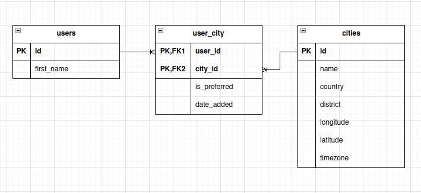

# Weather Bot

The Weather Forecast project implements a telegram bot.
The bot can provide weather information for certain periods
of time based on the name of the city.
Project development status: in support.
The project is almost completely covered with tests.

## Usage
***

To get started with the bot, follow the link https://t.me/i_weather_forecast_bot

Communication with the bot occurs through the lower keyboard.
You can add multiple cities to your profile.
You can also ask the bot for the current weather
and the weather for several days in advance.

## Development
***

### Installing dependencies

To install dependencies, run the command:

```
poetry install
```

### Installing pre-commit and updating dependencies

To install pre-commit, run the command:

```
make install_pre_commit
```
Which consists of:
```
pre-commit install
pre-commit install --hook-type commit-msg
pre-commit autoupdate
```

### Connecting to the database

PostgreSQL DBMS is used to work with the database. The application is launched using Docker Compose.

To connect to Docker Compose,
you need to copy the data from the `.env.tests` file to the `.env` file and edit it.

To get started with docker use the command:

```
docker-compose up
```

### Database migrations

To work with the database,
the project uses the SQLAlchemy library.
Alembic is used for database migrations.
Migrations are stored in the [src.services.db.migrations.versions](src/services/db/migrations/versions/) folder.

To generate the migration, run the command:
```
make generate
```
To perform the migration, run the command:
```
make migrate
```
### Database structure
#### UML diagram


### Testing

The project is covered with tests.
Testing was carried out using Pytest.
To run tests use the command:
```
pytest tests/
```

### Linters and Formatters

The following linters and formatters are used in the project:
`black, ruff, mypy`

To automatically fix some errors, use the command:
```
make fix
```
Which consists of:
```
black src tests
ruff check src tests --fix
```
To check the code, enter the command:
```
make check
```
It consists of:
```
black --check src tests
ruff check src tests
mypy --namespace-packages --explicit-package-bases src tests
pytest tests
```

## To do
***
- [x] Learn to process API requests.
- [x] Create a Telegram Bot.
- [x] Write an engine for working with a bot based on Telebot.
- [x] Run app in Docker using Docker Compose.
- [x] Explore the SQLAlchemy.
- [x] Study Alembic and create a migration.
- [x] Create a PostgreSQL Database and connect to it.
- [x] Cover the project with tests.
- [x] Deploy the project to the server.

## The project team
***
[Sokolova Polina — Python developer](https://github.com/Pololoshka)

## Sources
***
The project used the open source [Open-Meteo.com](https://open-meteo.com/).
On this source you can get Weather API and Geocoding API.
